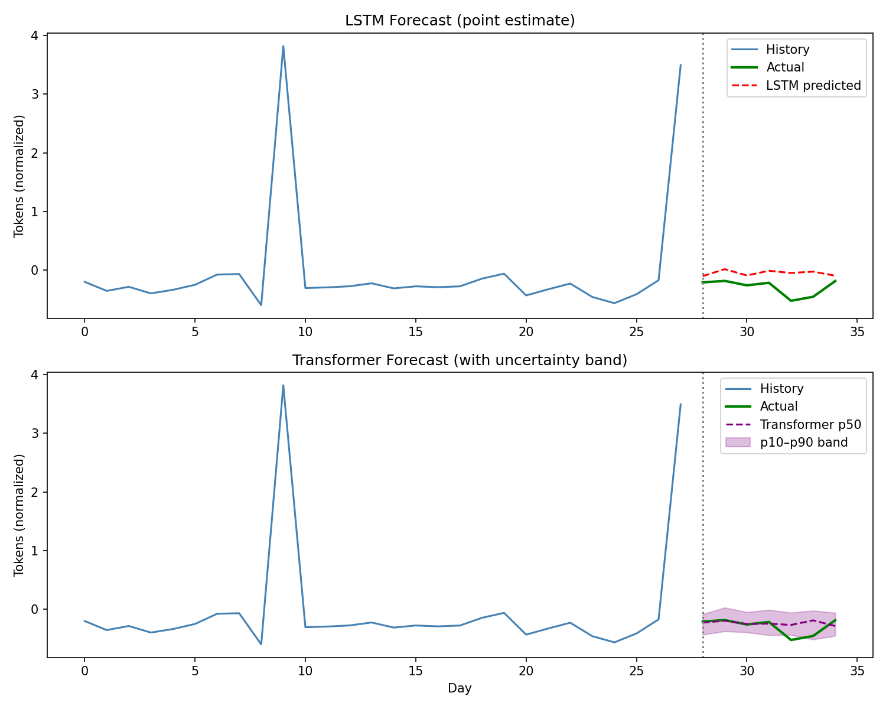

# LLM Cost Forecasting

A temporal transformer that predicts per-account LLM token usage for SaaS 
companies running LLM-powered features. Forecasts the next 7 days as a 
calibrated uncertainty range (p10/p50/p90) rather than a single point estimate.

**Live API:** https://llm-cost-forecasting.onrender.com/docs

## Results



| Model | MAE | Notes |
|---|---|---|
| Transformer (ours) | **0.0982** | Quantile output + pinball loss |
| LSTM baseline | 0.2393 | Point estimate + MSE loss |

- **59% MAE improvement** over LSTM baseline
- **7/7 days** actual values landed inside the p10–p90 uncertainty band
- Custom pinball loss function written from scratch

## Why this problem

Every SaaS company shipping LLM features now has unpredictable token costs. 
Spiky users, batch jobs, and retry loops can 3x a single account's daily spend. 
Finance teams need calibrated worst-case forecasts — not just averages — to 
budget for cost exposure. Almost no ML portfolio targets this problem.

## Architecture

```
Input: 28-day token usage history per account
    ↓
Linear projection → d_model=64
+ Positional encoding
    ↓
Transformer Encoder (2 layers, 4 heads)
    ↓
Quantile head → Output [7 days × 3 quantiles]
    ↓
p10 / p50 / p90 per future day
```

Trained with **pinball loss** — an asymmetric loss function that trains each 
quantile correctly. At p90, underprediction is penalized 9x harder than 
overprediction, forcing the model to give conservative worst-case estimates.

## Tech stack

PyTorch · FastAPI · Streamlit · Docker · pandas · NumPy · matplotlib

## Setup

```bash
git clone https://github.com/axelbennett/llm-cost-forecasting.git
cd llm-cost-forecasting
python -m venv pytorch-env
pytorch-env\Scripts\activate  # Windows
pip install torch numpy pandas scikit-learn matplotlib streamlit fastapi uvicorn
python data/generate_data.py
python Models/train_transformer.py
```

## Run the dashboard

```bash
streamlit run dashboard.py
# Opens at http://localhost:8501
```

## Run the API locally

```bash
uvicorn api:app --reload
# API available at http://127.0.0.1:8000/docs
```

## Run with Docker

```bash
docker build -t llm-cost-forecasting .
docker run -p 8000:8000 llm-cost-forecasting
# API available at http://localhost:8000/docs
```

## Project structure

```
llm-cost-forecasting/
  data/
    generate_data.py          # synthetic data generator
  Models/
    transformer.py            # temporal transformer architecture
    train.py                  # LSTM baseline training
    train_transformer.py      # transformer + pinball loss training
  losses/
    pinball_loss.py           # custom quantile loss function
  evaluate.py                 # LSTM evaluation + forecast plot
  compare.py                  # side-by-side model comparison
  dashboard.py                # Streamlit interactive dashboard
  api.py                      # FastAPI inference endpoint
  Dockerfile                  # containerized deployment
```

## Progress

- [x] Synthetic data generator (50 accounts x 90 days)
- [x] LSTM baseline trained and evaluated
- [x] Temporal transformer with quantile output head
- [x] Custom pinball loss function written from scratch
- [x] Model comparison — transformer beats LSTM by 59% MAE
- [x] Streamlit dashboard with live forecast band chart
- [x] FastAPI inference endpoint
- [x] Docker container
- [x] Deployed to Render — live public URL

## Status

✅ Complete — portfolio project targeting ML Engineer / AI Engineer roles

